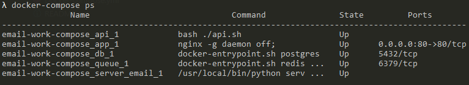
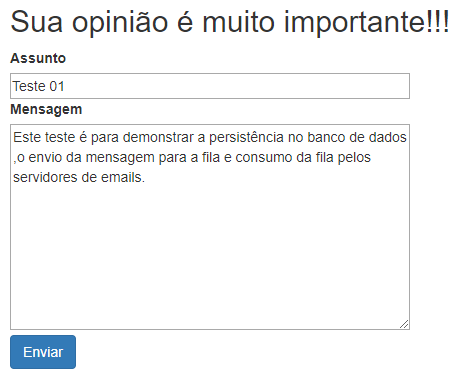
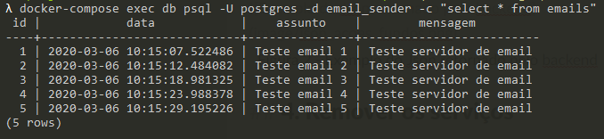
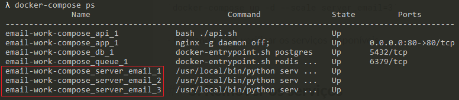
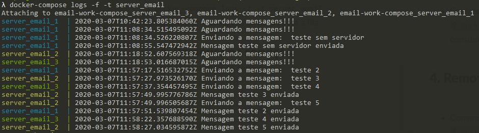

# Email Sender

Microservices para envio de emails com frontend em Bootstrap, backend em Python, banco PostrgreSQL e fila com Redis.

## Faça agora, por que na minha máquina funciona ;)
1. [Baixar projeto](#1-baixar-projeto)
2. [Inicializando os serviços](#2-inicializando-os-serviços)
3. [Como testar o projeto?](#3-como-testar-o-projeto)
 3.1 [Tela de envio de mensagens:](#31---tela-de-envio-de-mensagens)
 3.2 [Consulta das mensagens enviadas no item anterior e persistidas no banco de dados PostgreSQL](#32-consulta-das-mensagens-enviadas-no-item-anterior-e-persistidas-no-banco-de-dados-postgresql)
 3.3 [Replicando servidor de emails](#33-replicando-servidor-de-emails)
 3.4 [Log do consumo da fila Redis](#34-log-do-consumo-da-fila-redis)
4. [Remover os serviços](#4-remover-os-servi%C3%A7os)
5. [Licença](#5-licença)

Requisitos necessários para prosseguir :
*  [Git](https://git-scm.com/downloads)
*  [Docker](https://docs.docker.com/get-docker/)
*  [Docker Compose](https://docs.docker.com/compose/install/)

## 1. Baixar projeto
- No console do seu sistema operacional execute o comando: 
 `$ git clone https://github.com/Maddytec/email-sender.git`
 

## 2. Inicializando os serviços

 - Comandos para iniciar os serviços:
 `$ cd email-sender`
  `$ docker-compose up -d`

- Comando para listar os serviços:
 `$ docker-compose ps`

 Figura 1 - Retorno do comando docker-compose ps

## 3. Como testar o projeto?

Após executar o item 2:
  
### 3.1 - Tela de envio de mensagens:

 - Acessar a URL: [http://localhost](http://localhost) para visualizar a pagina disponibilizada referente ao frontend

 Figura 2 - Tela de envio de  mensagens
  
### 3.2 Consulta das mensagens enviadas no item anterior e persistidas no banco de dados PostgreSQL
`$ docker-compose exec db psql -U postgres -d email_sender -c "select * from emails"`
 

 Figura 3 - Mensagens persistidas

## 3.3 Replicando servidor de emails
- Comando para replicar o serviço de emails:
 `$ docker-compose up -d --scale server_email=3`

- Comando para verificar os serviços disponíveis
 `docker-compose ps`    

 
 Figura 4 - Retorno do comando docker-compose ps

## 3.4 Log do consumo da fila Redis
- Comando para acompanhar o log dos servidores de emails consumindo a fila
 `$ docker-compose logs -f -t server_email` 

 
 Figura 5 - Exemplo de log dos servidores de emails
 
## 4. Remover os serviços
- Comando para parar os serviços:
 `$ docker-compose stop`

- Comando para remover os serviços:
 `$ docker-compose rm`

## 5. Licença

Este código é open source (código aberto).
